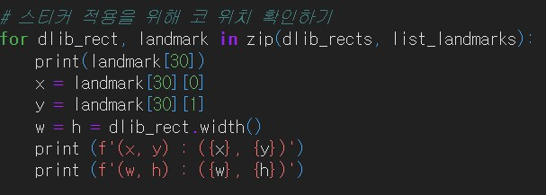
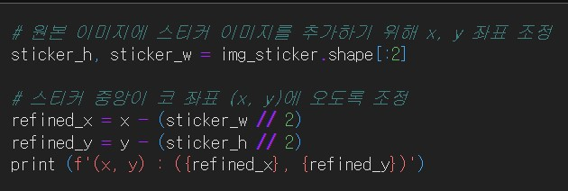
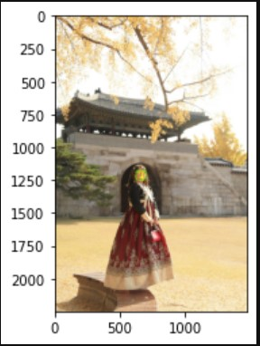
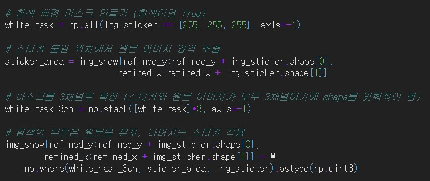
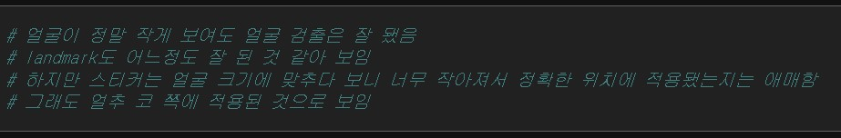

# AIFFEL Campus Online Code Peer Review Templete
- 코더 : 오가현
- 리뷰어 : 김범모

# PRT(Peer Review Template)
- [ O ]  **1. 주어진 문제를 해결하는 완성된 코드가 제출되었나요?**
  - 코 위치를 이용하였고 스티커의 좌상단 x,y 좌표를 적절하게 작성하였습니다.
  
  - 고양이스티커의 흰색 부분은 원본 이미지로 넣는 처리과정을 통해 자연스럽게 고양이스티커가 합성되었습니다.
  
       
- [ O ]  **2. 전체 코드에서 가장 핵심적이거나 가장 복잡하고 이해하기 어려운 부분에 작성된 
주석 또는 doc string을 보고 해당 코드가 잘 이해되었나요?**
  - 코드에 주석이 있었고 markdown도 작성하였습니다.
        
- [ O ]  **3. 에러가 난 부분을 디버깅하여 문제를 해결한 기록을 남겼거나
새로운 시도 또는 추가 실험을 수행해봤나요?**
  - 멀리 있는 사진도 얼굴 및 keypoint 탐지가 되는지 실험해보고 탐지가 된다는 사실을 알았습니다.
    
  - 고양이 사진의 흰색부분을 없애기 위해서 3차원 흰색 마스크를 만들고 np.where에 넣어주어 해결하였습니다.
    
    
- [ O ]  **4. 회고를 잘 작성했나요?**
  - 실험마다 회고를 작성하여 실험결과와 문제를 해결한 기록을 알 수 있었습니다.
    
    
        
- [ O ]  **5. 코드가 간결하고 효율적인가요?**
  - 코드가 필요한 부분만 존재했고, 간결하고 효율적이었습니다.

# 회고(참고 링크 및 코드 개선)
코드에 필요없는 부분이 없어보였고 간결하고 효율적이었습니다.  
주석이 있어서 다른 사람이 봐도 코드를 이해하는데 어려움이 없었고 추가 실험을 통해 멀리 있는 사진도  
얼굴 탐지가 된다는 새로운 사실도 알게되었습니다. add_weighted를 사용한 블렌딩은 평가항목에는 없었지만
고양이 스티커를 좀 더 자연스럽게 합성할 수 있어서 재미로 사용해보시면 좋을 거 같습니다!
