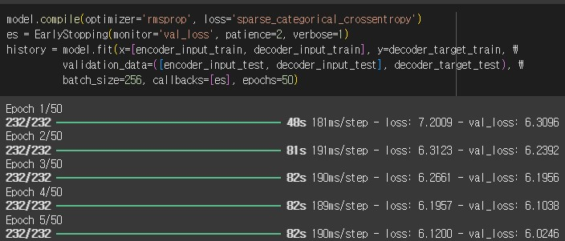
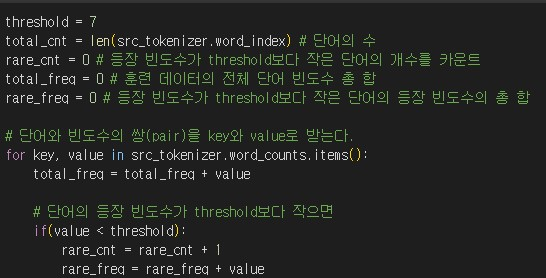
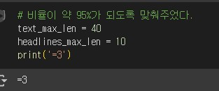

# AIFFEL Campus Online Code Peer Review Templete
- 코더 : 오가현
- 리뷰어 : 김범모

# PRT(Peer Review Template)
- [ O ]  **1. 주어진 문제를 해결하는 완성된 코드가 제출되었나요?**
    - seq2seq에 attention을 사용한 모델을 설계하였고 훈련 및 추론을 진행하였습니다.
    - 
    
- [ O ]  **2. 전체 코드에서 가장 핵심적이거나 가장 복잡하고 이해하기 어려운 부분에 작성된 
주석 또는 doc string을 보고 해당 코드가 잘 이해되었나요?**
    - 전체적으로 코드의 기능을 설명하는 주석이 있었습니다.
    - 
        
- [ O ]  **3. 에러가 난 부분을 디버깅하여 문제를 해결한 기록을 남겼거나
새로운 시도 또는 추가 실험을 수행해봤나요?**
    - 원본과 요약본 시퀀스의 길이를 정할 때 95%의 비율이 되게끔 정했습니다.
    - 
        
- [ O ]  **4. 회고를 잘 작성했나요?**
    - 설명을 해주실 때 실험과정과 해당 코드가 있는 이유를 말씀해주셨습니다.
    - 그리고 마크다운을 사용하여 단계별 기능을 구분하였습니다.
        
- [ O ]  **5. 코드가 간결하고 효율적인가요?**
    - 전체적으로 필요한 코드만 있었고 마크다운을 사용하여 코드의 기능을 구별하였습니다.

# 회고(참고 링크 및 코드 개선)
노트북 파일에 마크다운으로 알아보기 쉽게 정리해주셔서 깔끔하게 코드를 볼 수 있었습니다!
