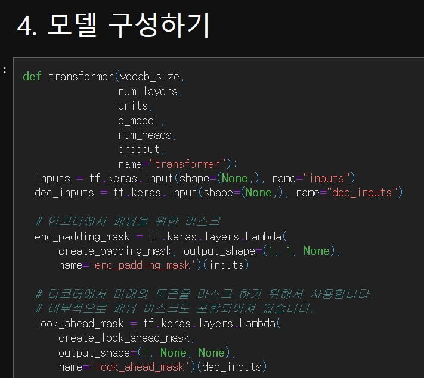
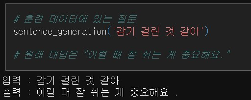
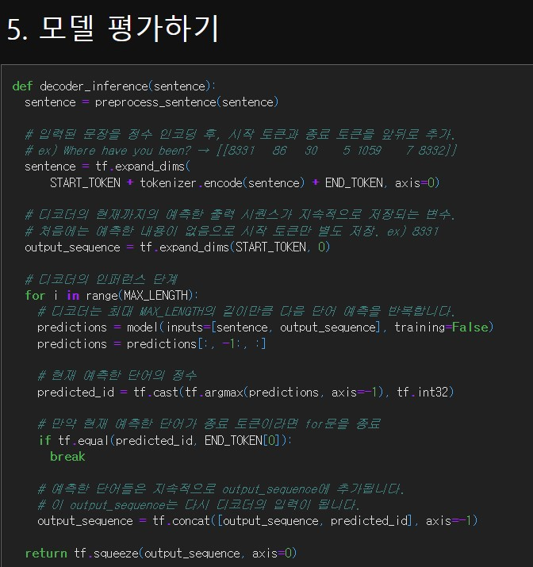
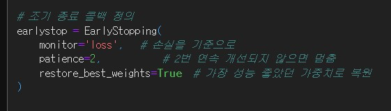
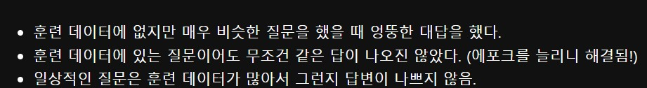

# AIFFEL Campus Online Code Peer Review Templete
- 코더 : 오가현
- 리뷰어 : 김범모

# PRT(Peer Review Template)
- [ O ]  **1. 주어진 문제를 해결하는 완성된 코드가 제출되었나요?**
    - 문제에서 요구하는 최종 결과물이 첨부되었는지 확인
        - 중요! 해당 조건을 만족하는 부분을 캡쳐해 근거로 첨부
    - 
    - 트랜스포머 모델을 구조별로 만드셨고 잘 결합하여 모델 학습 진행 후 추론까지 완료하였습니다.
    - 
    - 학습된 모델이 답변을 잘 하는 것을 확인할 수 있었습니다.
    
- [ O ]  **2. 전체 코드에서 가장 핵심적이거나 가장 복잡하고 이해하기 어려운 부분에 작성된 
주석 또는 doc string을 보고 해당 코드가 잘 이해되었나요?**
    - 
    - 트랜스포머 모델로 추론하는 코드를 작성하셨고 주석도 작성해주셨습니다.

    
- [ O ]  **3. 에러가 난 부분을 디버깅하여 문제를 해결한 기록을 남겼거나
새로운 시도 또는 추가 실험을 수행해봤나요?**
    - 
    - epoch 10번으로 학습을 진행 한 후에 epoch를 많이 늘려야겠다고 생각하셨고, early stop을 사용하셨습니다.
        
- [ O ]  **4. 회고를 잘 작성했나요?**
    - 
        
- [ O ]  **5. 코드가 간결하고 효율적인가요?**
    - 전체적으로 필요한 코드만 존재하였고 효율적이었습니다.

# 회고(참고 링크 및 코드 개선)
최대 문장길이가 28인데 max_len을 40으로 잡으셔서 필요없는 부분이 12 추가된 것이..
28로 잡았어도 성능이 더 올랐을 거 같아서 아쉽습니다 ㅠㅠ
early stop 사용해서 일반화 성능을 챙기려고 한 점과 전체적으로 데이터 전처리 분석까지 완벽했던 거 같습니다!
