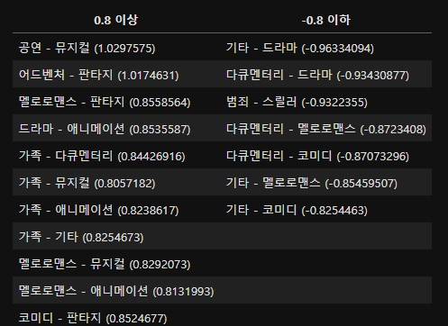
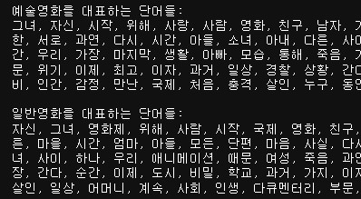
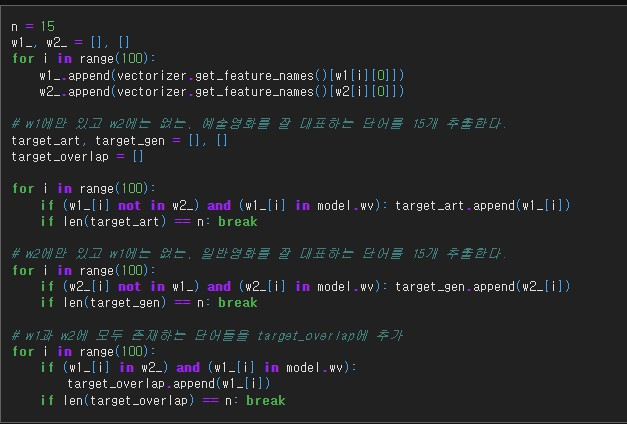
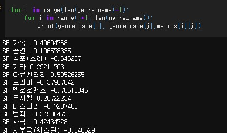
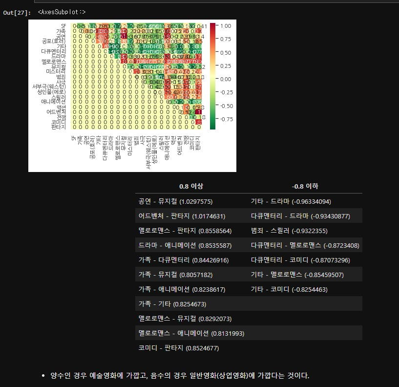

# AIFFEL Campus Online Code Peer Review Templete
- 코더 : 오가현
- 리뷰어 : 김범모

# PRT(Peer Review Template)
- [ O ]  **1. 주어진 문제를 해결하는 완성된 코드가 제출되었나요?**

        - WEAT 스코어를 추출하였습니다.
  

        - IT-IDF를 사용해서 target, attributes를 대표하는 단어를 추출하였습니다.
  

- [ O ]  **2. 전체 코드에서 가장 핵심적이거나 가장 복잡하고 이해하기 어려운 부분에 작성된 
주석 또는 doc string을 보고 해당 코드가 잘 이해되었나요?**

        - 주석이 달려 있어서 이해하기 쉬웠씁니다.
  

- [ O ]  **3. 에러가 난 부분을 디버깅하여 문제를 해결한 기록을 남겼거나
새로운 시도 또는 추가 실험을 수행해봤나요?**

        - 장르별로 모아서 WEAT 스코어를 추출하였습니다.

- [ O ]  **4. 회고를 잘 작성했나요?**

        - 최종 WEAT score 결과를 표로 정리하여 보여주었고 양수인 경우와 음수의 경우의 의미를 설명하셨습니다.

- [ O ]  **5. 코드가 간결하고 효율적인가요?**

        - 전체적으로 코드가 간결하고 효율적이었습니다.

# 회고(참고 링크 및 코드 개선)
중간중간 마크다운으로 정리해주셔서 이해하기 좋았습니다!
