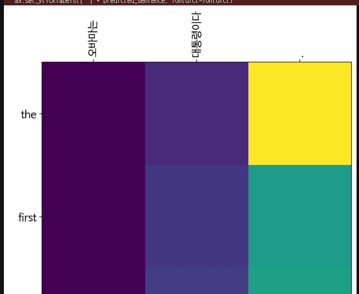
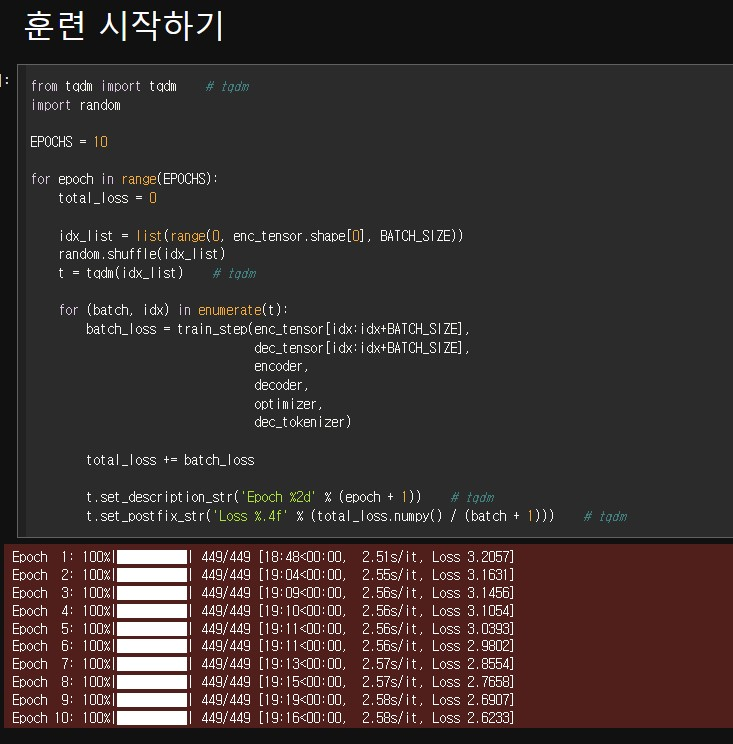
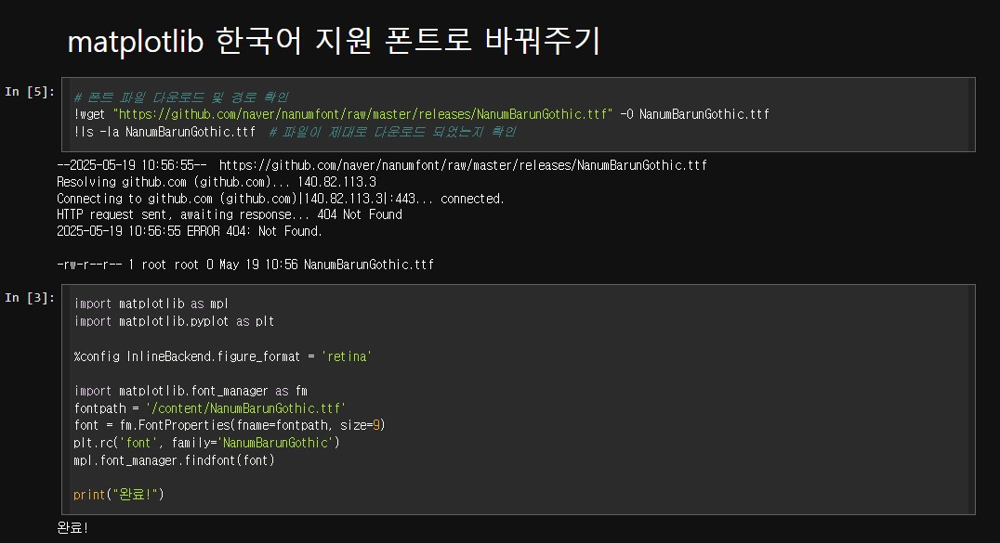
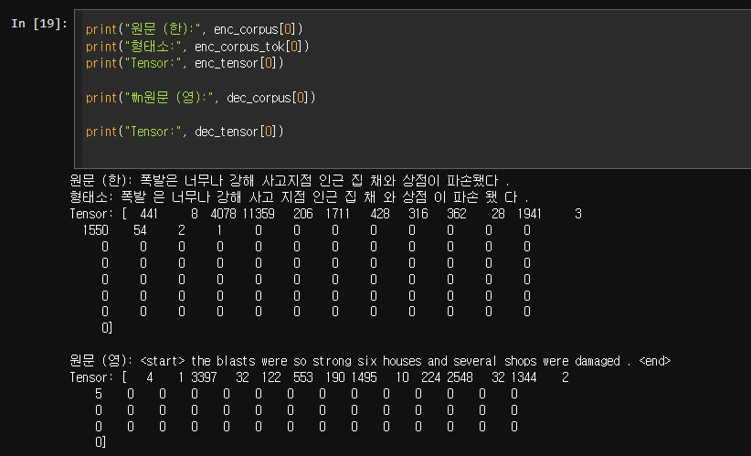

# AIFFEL Campus Online Code Peer Review Templete
- 코더 : 오가현
- 리뷰어 : 김범모

# PRT(Peer Review Template)
- [ O ]  **1. 주어진 문제를 해결하는 완성된 코드가 제출되었나요?**

        - 학습이 잘 이루어졌고 성능 평가와 어텐션 맵을 잘 그려주셨습니다.
    
    
- [ O ]  **2. 전체 코드에서 가장 핵심적이거나 가장 복잡하고 이해하기 어려운 부분에 작성된 
주석 또는 doc string을 보고 해당 코드가 잘 이해되었나요?**

        - 전체적으로 주석이 잘 작성되어 있었습니다.

        
- [ O ]  **3. 에러가 난 부분을 디버깅하여 문제를 해결한 기록을 남겼거나
새로운 시도 또는 추가 실험을 수행해봤나요?**

        
        - 코랩에서 한국어 지원 폰트로 바꿔주기 위해서 해당 코드를 작성하셨습니다.

        - MeCab의 형태소 추출 결과를 확인했습니다.

        
- [ O ]  **4. 회고를 잘 작성했나요?**

        - 회고는 없었지만 설명 해주실 때 실험결과를 말씀해주셨습니다.

- [ O ]  **5. 코드가 간결하고 효율적인가요?**

        - 네 필요한 코드만 있었고 간결하고 효율적이었습니다.

# 회고(참고 링크 및 코드 개선)
전체적으로 필요한 부분이 다 들어가있었고 설명도 이해하기 쉽게 깔끔하게 해주셔서 도움 많이 되었습니다.
